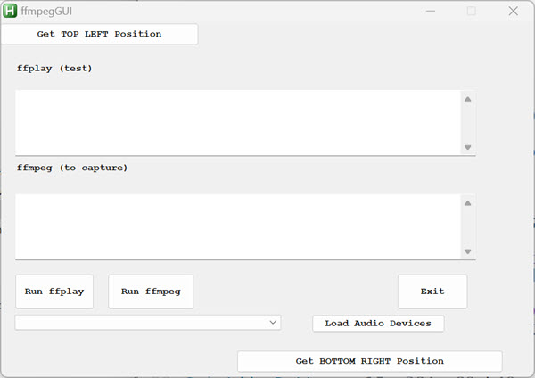

# Headless Filmmaking
**Tools** to work with video/audio using headless tools like ffmpeg.  These all work, but far from robust.  

Most current dev in \scripts_vertical_shorts

Most ffmpeg snippets in \cookbooks

***IN DEVELOPMENT!*** Using ffmpeg builds from [Gyan.dev](https://www.gyan.dev/ffmpeg/builds/) (I want latest HVENC (GPU) libraries)

You need [AutoHotKey](https://www.autohotkey.com/) (version 1.1 -- NOT version 2) installed for these scripts to work.

INSTRUCTIONS.  First, you must have ffmpeg installed on your Windows PC and it must be findable through the Windows environment path  (or you'll have to hard code where you have it in the code).  Next, put all these files in a folder.  For the Webcam capture, you'll want to press the button "Load Available Capture Devices".  From the list, pick the webcam and microphone devices you want to use.  Then press "Save My Capture Devices".  They should load every time you launch the GUI (unless you change them)

o. Fast conversion of media files

o. Capture a portion of the screen and use some tricks to make it a transparent webm video that can be used as graphics later on.

o. Quick trim tool for videos

o. Webcam capture using some cool techniques from FFMPEG GUY.

Big thanks for inspiration from [FFMPEG GUY](https://www.youtube.com/@theFFMPEGguy). @maclev on the AHK forum solved a very difficult problem I came up against in the ffmpeg webcam capture script.
